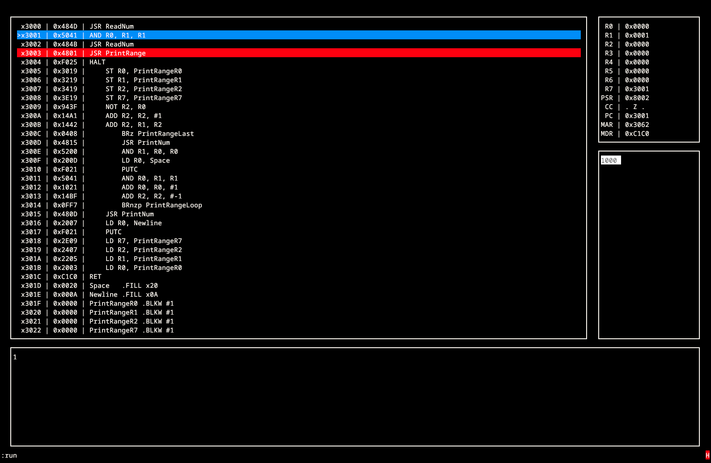

# LC3TUI

LC3 simulator with a simple terminal UI, written in C


*TUI with loaded assembly (with debug info), PC and a breakpoint visible, some output and queued input. Registers have already been modified*


## Getting Started

### Dependencies

* Linux (untested on Windows/MacOS)
* C compiler
* ncurses


### Installing

* clone the repo
```
git clone https://github.com/beeldscherm/lc3tui.git
```

* Either run the makefile or compile the C files using your preferred compiler
```
make
```


### Running

After compilation, running the executable will put you into the TUI.
The executable generated by the makefile is called `lc3tui`.


### Help

```
Controls:
    Escape  | Quit the TUI.
    Up      | Move the memory view up one address.
    Down    | Move the memory view down one address.
    :       | Start typing a command
```


To see a list of possible TUI commands, run `:help`.
If you do not feel like doing that, here is the list of commands

```
Commands:
    l[oa]d FILE            | Loads .lc3 file into memory
    b[reak]p[point] N ...  | Sets breakpoint at provided locations (PC assumed).
    s[et] [N1] N2          | Sets address N1 (PC assumed) to N2.
    r[eg] R N              | Sets register R to value N.
    run                    | Run simulator until breakpoint or halted.
    h[alt]                 | Halt simulator.
    st[ep] [N]             | Execute N instructions (1 assumed), or until breakpoint.
    u[ndo] [N]             | Undo previous N instructions (1 assumed).
    n[um] [x/i/u]          | Set number display type (hex, int, unsigned), hex assumed.
    q[uit]                 | Quit this program.
    in[put] ...            | Queues any characters (possibly escaped) after the delimiter for input.
    n[o]in[put]            | Delete all queued input.
    restart                | Clear simulator.
    g[o] [N]               | Scroll memory view N (PC assumed).
    help                   | Show this message.
    i[nput]f[ile] FILE     | Set file to take input from, this file has higher precedence than the input box.
    o[utput]f[ile] FILE    | Set file to put output into, control characters are outputted directly.
    clear                  | Clear output box.
    c[ou]nt [get]          | Get instrutions executed since last counter reset
    c[ou]nt reset          | Reset counter to 0
    c[ou]nt total          | Get total amount of instructions executed
    WHERE [N] is either a [REG] (register string) or number.
```


## Problems

Please create an issue if you encounter any bugs!


## TODO

- [ ] Read functions for other LC3 file formats
- [ ] Some more keybinds
- [ ] Saving/loading entire simulator state
- [ ] PSR and other LC3 details
- [ ] CLI/headless mode
